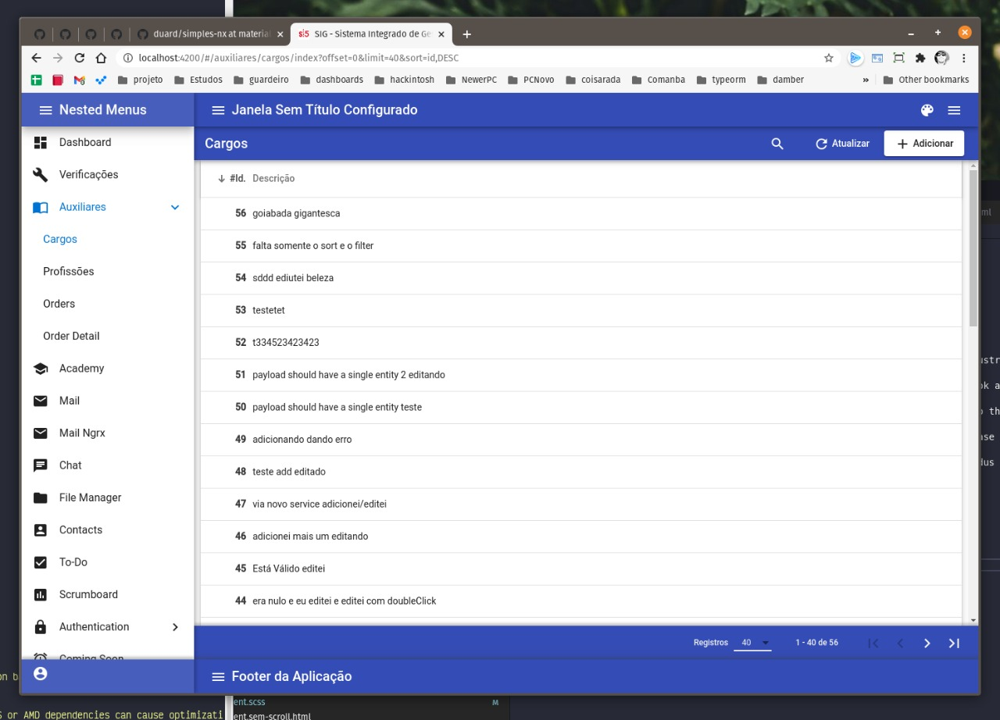

# Projeto BASE

[Exemplo de como fica o código de um CRUD](https://github.com/duard/simples-nx/blob/master/libs/app-cruds/src/lib/menus/index/index.component.ts)


Atualizar o projeto inteiro, sempre mantenha ele atualizado, não seja um goiaba que deixa as coisas em 1998.

```shell
npm uninstall -g angular-cli;
npm install -g @angular/cli@latest;
npx ng update --all --force;
npm audit fix; npm audit fix --force;
```

rodar a API e o APP paralelamente :-D `npm run dev`

```shell
npx nx run-many --target=serve --projects=simples-app,simples-api --parallel=true

npx nx run-many --target=serve --projects=front,api --parallel=true
npx nx run-many --target=serve --configuration=development --projects=front,api --parallel=true --maxParallel=100
npx nx run-many --target=serve --configuration=qa --projects=front,api --parallel=true --maxParallel=100
npx nx run-many --target=serve --configuration=production --projects=front,api --parallel=true --maxParallel=100
```

Gerar todas as Entities do seu banco de dados

```shell
npx typeorm-model-generator -h localhost -d seubancodedados -u seuusuario -x suasenha -e mysql -o .
```

Criar uma nova Library NestJS

```shell
nx generate @nrwl/nest:library lib-nome-a-ser-creiada
```

##### installs angular

```
npm i @ngrx/store-devtools @ngrx/store @ngrx/effects @ngrx/store-devtools @ngrx/schematics  @angular/animations @angular/cdk @angular/cdk @angular/flex-layout @angular/material  @angular/material-moment-adapter @ngx-translate/core  @ngrx/router-store --save
npm i --save-dev ngrx-store-freeze
npm audit fix; npm audit fix --force;

```

#### installs nestjs

```
npm i --save typeorm @nestjs/config @nestjs/typeorm @nestjs/common dotenv-flow mysql
npm i --save-dev

npm audit fix; npm audit fix --force;

```

## configure o cypress para rodar no WSL2 :-)

https://nickymeuleman.netlify.app/blog/gui-on-wsl2-cypress

```
npm uninstall cypress --save-dev; npm install cypress --save-dev;
```

## configurar o cache

Connect the workspace to your Nx Cloud account at https://nx.app/orgs/workspace-setup?accessToken=ZjFjYzI4OWMtNzY1Ny00MjYyLWI3YmItMmRkMjhkZmNlZDdkfHJlYWQtd3JpdGU=. This will allow you to configure the cache and see detailed stats. You can do it later.

#### coisas boas

Diversos links bacanas

##### links nestjs

https://awesomeopensource.com/project/juliandavidmr/awesome-nestjs
